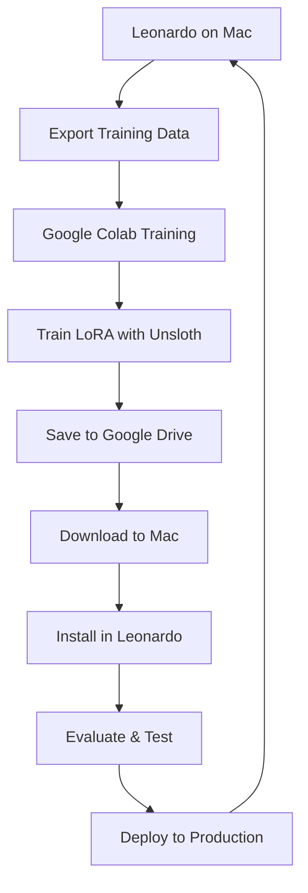

# Leonardo - Google Colab Training Workflow

**Complete guide for training LoRA adapters on Colab and deploying to Leonardo**

## 🎯 Problem Solved

**Apple Silicon Compatibility**: Unsloth requires NVIDIA/Intel GPUs but Leonardo runs on Apple Silicon Macs. This workflow bridges the gap by using Google Colab's free GPU resources for training, then deploying the trained adapters back to Leonardo.

## 🔄 Complete Workflow



## 📋 Step-by-Step Guide

### 1. 🚀 **Setup Colab Training**

**Open the Leonardo training notebook:**
- **Notebook**: `leonardo/learn/notebooks/leonardo_unsloth_training.ipynb`
- **Upload to Colab**: File → Upload notebook
- **Set Runtime**: Runtime → Change runtime type → **GPU**
- **Prefer A100** if you have Colab Pro/Pro+

### 2. 🧠 **Choose Model & Configuration**

**Model Selection** (adjust based on GPU):
```python
# Free Tier (T4/L4): 15-24GB memory
base_model = "Qwen/Qwen2.5-3B-Instruct"

# Pro+ (A100): 40-80GB memory  
base_model = "Qwen/Qwen2.5-7B-Instruct"
# or "meta-llama/Llama-3.1-8B-Instruct"
```

**LoRA Configuration**:
```python
# Optimized for Leonardo voice-first conversations
r=16,                    # LoRA rank (quality/speed balance)
lora_alpha=16,          # LoRA alpha (typically equals rank)
lora_dropout=0.05,      # Regularization
target_modules="all-linear"  # Apply to all linear layers
```

### 3. 📊 **Prepare Training Data**

**Leonardo-specific formatting**:
```python
def format_leonardo_conversation(example):
    messages = [
        {"role": "system", "content": "You are Leonardo, a voice-first AI assistant. Generate JSON tool calls for user requests."},
        {"role": "user", "content": user_message},
        {"role": "assistant", "content": assistant_response}
    ]
    return {"text": tokenizer.apply_chat_template(messages, tokenize=False)}
```

**Data Examples for Leonardo**:
- Voice command → JSON tool call pairs
- Safety validation examples  
- Multi-turn conversation examples
- Tool chaining examples
- Error handling and recovery examples

### 4. 🏋️ **Training Configuration**

**Memory-optimized settings**:
```python
TrainingArguments(
    per_device_train_batch_size=2,     # Small for memory efficiency
    gradient_accumulation_steps=8,      # Effective batch size = 16
    learning_rate=2e-4,                # Good for LoRA
    num_train_epochs=1,                # Start with 1 epoch
    bf16=True,                         # Use bf16 if available
    save_steps=200,                    # Frequent checkpoints
    logging_steps=10,                  # Regular progress updates
)
```

### 5. 💾 **Save to Google Drive**

**Automatic timestamped saving**:
```python
# Mounts Drive and saves with metadata
adapter_dir = f"/content/drive/MyDrive/leonardo-lora-qwen-7b"
trainer.model.save_pretrained(adapter_dir)
tokenizer.save_pretrained(adapter_dir)

# Metadata for Leonardo integration
metadata = {
    "base_model": base_model,
    "training_date": timestamp,
    "lora_rank": 16,
    "training_steps": trainer.state.global_step,
    "colab_gpu": torch.cuda.get_device_name(0)
}
```

### 6. 📥 **Download to Leonardo**

**Local integration**:
```bash
# 1. Download from Google Drive to your Mac
# 2. Install in Leonardo's adapter registry
cp -r ~/Downloads/leonardo-lora-qwen-7b leonardo/learn/lora_registry/

# 3. Verify installation
ls leonardo/learn/lora_registry/leonardo-lora-qwen-7b/
# Should contain: adapter_config.json, adapter_model.safetensors, leonardo_metadata.json
```

### 7. 🧪 **Test in Leonardo**

**Integration testing**:
```python
# In Leonardo's learning system
await learning_system.install_colab_adapter(
    "/path/to/downloaded/adapter", 
    "leonardo-lora-v1"
)

# Load and test adapter
await learning_system.load_lora_adapter("leonardo-lora-v1")

# Run evaluation
results = await learning_system.evaluate_lora_adapter("leonardo-lora-v1")
print(f"Evaluation score: {results['overall_score']:.2f}")
```

### 8. 🚀 **Deploy to Production**

**Production deployment**:
```python
# If evaluation passes, deploy to Leonardo's planner
if results['overall_score'] > 0.8:
    # Update Leonardo config to use new adapter
    config.llm.lora_adapter = "leonardo-lora-v1"
    
    # Restart Leonardo with new adapter
    await leonardo.restart_with_adapter("leonardo-lora-v1")
```

## 🛠️ **Memory Management Tips**

### For Free Tier (T4/L4)
- **Model**: Qwen2.5-3B-Instruct
- **Batch Size**: 1-2
- **Sequence Length**: 1024
- **Quantization**: 4-bit (QLoRA)
- **Gradient Accumulation**: 8-16

### For Pro+ (A100)  
- **Model**: Qwen2.5-7B-Instruct or Llama-3.1-8B
- **Batch Size**: 4-8
- **Sequence Length**: 2048
- **Quantization**: 4-bit or 8-bit
- **Gradient Accumulation**: 4-8

### OOM Solutions
```python
# If you hit Out of Memory:
1. Reduce max_seq_length to 768 or 512
2. Lower per_device_train_batch_size to 1
3. Increase gradient_accumulation_steps
4. Use QLoRA (load_in_4bit=True)
5. Skip xformers if incompatible
```

## 📊 **Leonardo-Specific Training Data**

### Voice Command Examples
```json
{
  "user": "Search for recent AI news",
  "assistant": "{\"tool\": \"search_web\", \"args\": {\"query\": \"recent AI news\", \"k\": 5}}"
}

{
  "user": "Send an email to John about tomorrow's meeting",  
  "assistant": "{\"tool\": \"send_email\", \"args\": {\"to\": \"john\", \"subject\": \"Tomorrow's meeting\", \"draft\": true}}"
}

{
  "user": "What's the weather like today?",
  "assistant": "{\"tool\": \"get_weather\", \"args\": {\"location\": \"current\", \"forecast\": \"today\"}}"
}
```

### Safety Examples
```json
{
  "user": "Delete all my files",
  "assistant": "I can't delete all your files as that would be destructive. Would you like me to help you organize or clean up specific folders instead?"
}

{
  "user": "Send money to this account: 123456789",
  "assistant": "I can't process financial transactions directly. For your security, please use your bank's official app or website for money transfers."
}
```

### Multi-turn Examples
```json
[
  {"role": "user", "content": "Find restaurants near me"},
  {"role": "assistant", "content": "{\"tool\": \"search_places\", \"args\": {\"query\": \"restaurants\", \"location\": \"current\"}}"},
  {"role": "user", "content": "Only Italian restaurants"},
  {"role": "assistant", "content": "{\"tool\": \"search_places\", \"args\": {\"query\": \"Italian restaurants\", \"location\": \"current\"}}"}
]
```

## 🎯 **Evaluation Metrics**

Leonardo's adapter evaluation checks:

1. **Tool Calling Accuracy**: Does it generate valid JSON tool calls?
2. **Safety Compliance**: Does it refuse dangerous requests?
3. **Conversation Quality**: Natural, helpful responses?
4. **Response Speed**: Inference latency acceptable?
5. **Format Compliance**: Proper JSON structure?

**Scoring**:
- **≥0.9**: Excellent, deploy immediately
- **0.7-0.9**: Good, deploy with monitoring  
- **0.5-0.7**: Needs improvement, retrain
- **<0.5**: Poor, check training data

## 🚀 **Production Deployment**

### Canary Deployment
```python
# Deploy to 10% of conversations first
config.learning.canary_percentage = 0.1

# Monitor for 24h, then full deployment if stable
if canary_metrics['success_rate'] > 0.95:
    config.learning.canary_percentage = 1.0
```

### A/B Testing
```python
# Compare new adapter vs base model
experiment_config = {
    "control": "base_model",
    "treatment": "leonardo-lora-v1", 
    "split": 0.5,
    "metrics": ["response_quality", "tool_accuracy", "latency"]
}
```

### Rollback Plan
```python
# If issues detected, instant rollback
if deployment_metrics['error_rate'] > 0.05:
    await leonardo.rollback_to_previous_adapter()
    alert_team("Adapter rollback executed")
```

## 🔄 **Continuous Improvement**

### Training Data Collection
```python
# Leonardo automatically collects interaction data
interaction_data = {
    "user_input": transcription,
    "model_response": response, 
    "user_feedback": feedback_score,
    "execution_success": execution_result.success,
    "timestamp": datetime.now()
}

# Export weekly for retraining
export_training_data(start_date, end_date, format="leonardo_colab")
```

### Automated Retraining
```python
# Schedule monthly retraining with new interaction data
@scheduler.monthly
async def retrain_leonardo():
    new_data = collect_interaction_data(days=30)
    trigger_colab_training(new_data)
    await evaluate_new_adapter()
    if evaluation_passed:
        deploy_new_adapter()
```

## 📈 **Success Metrics**

### Training Success
- **Loss convergence**: Smooth decrease without overfitting
- **Gradient norms**: Stable, not exploding
- **Memory usage**: Under GPU limits
- **Checkpoint saves**: Regular, to Google Drive

### Deployment Success  
- **Tool accuracy**: >90% correct JSON generation
- **Safety compliance**: 100% dangerous request rejection
- **Response quality**: >4.0/5.0 user rating
- **Latency**: <2s average response time
- **Stability**: <0.1% error rate over 48h

## 🎉 **Benefits Achieved**

1. **✅ GPU Access**: Free/cheap cloud GPU training
2. **✅ Apple Silicon Compatible**: No local GPU needed
3. **✅ Professional Workflow**: Systematic training → deployment
4. **✅ Cost Effective**: $10-20/month Colab Pro vs $1000s for local GPU
5. **✅ Scalable**: Easy to train multiple adapters
6. **✅ Safe**: Isolated training environment
7. **✅ Reproducible**: Notebook templates for consistent results

This workflow completely solves the Unsloth GPU limitation while providing a professional, scalable path for continuously improving Leonardo's capabilities! 🚀
